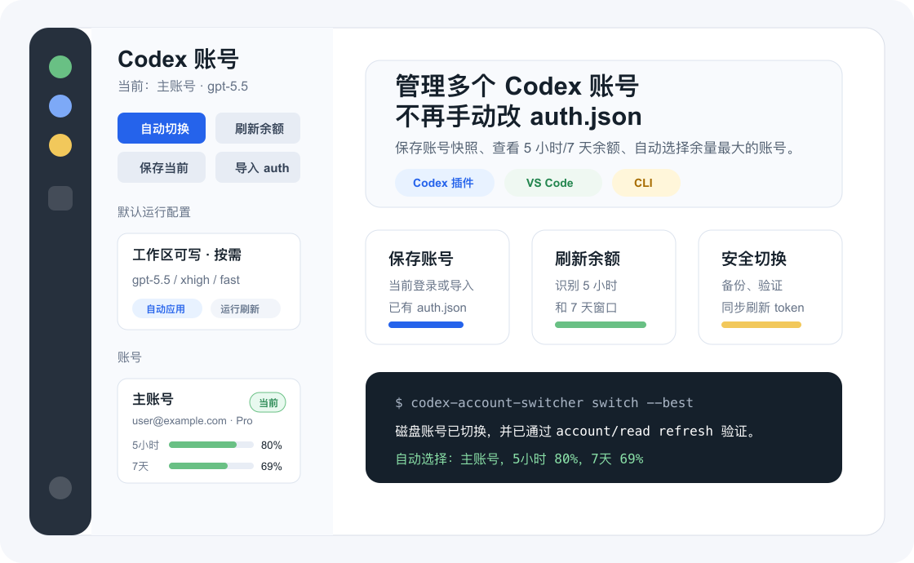

<p align="center">
  
</p>

<h1 align="center">Codex 账号切换器</h1>

<p align="center">
  管理多个 Codex <code>auth.json</code> 快照，查看 5 小时 / 7 天余额，并快速切换到指定账号或余额最多的账号。
</p>

<p align="center">
  <a href="https://github.com/Nahuyiur/codex-switcher"></a>
  
  
  
</p>

## 适合谁

如果你有多个 Codex 账号，或者经常在本机 Codex App、VS Code Remote SSH、远程服务器之间切换账号，这个工具可以把“手动复制 `~/.codex/auth.json`”变成一个可验证、可回滚、可自动选择的流程。

| 能力 | 做什么 |
| --- | --- |
| 账号库 | 保存当前 Codex 登录，或从指定路径导入已有 `auth.json`。 |
| 余额视图 | 读取 Codex 5 小时和 7 天窗口，显示剩余百分比和重置时间。 |
| 快速切换 | 写入目标机器的 `~/.codex/auth.json`，写入前备份，写入后验证。 |
| 自动选择 | 按 `min(5小时余额, 7天余额)` 选择瓶颈余额最大的账号。 |
| 默认配置 | 切换账号后自动恢复访问权限、审批策略、模型、智能档和速度档。 |

## 三种入口

| 入口 | 推荐场景 | 体验 |
| --- | --- | --- |
| **Codex App 插件** | 你主要在 Codex App 里使用 | 直接对 Codex 说中文命令，例如“切换到余额最多的账号”。 |
| **VS Code 扩展** | 本机 VS Code 或 Remote SSH | Activity Bar 侧栏、状态栏、账号列表、余额条和默认配置面板。 |
| **CLI** | 自动化、脚本、调试 | `codex-account-switcher switch --best` 这类命令式入口。 |

工具只操作当前机器上的 Codex 配置。VS Code Remote SSH 中使用时，扩展运行在远程 extension host，因此修改的是远程服务器的 `~/.codex/auth.json` 和 `~/.codex/config.toml`，不会自动同步本机账号。

## 最快开始：Codex App 插件

在仓库根目录安装依赖、构建 CLI，并把 `codex-account-switcher` 链接到本机 PATH：

```bash
npm install
npm run build
npm link
```

安装 Codex 插件：

```bash
codex plugin marketplace add Nahuyiur/codex-switcher --ref main
codex plugin add codex-account-switcher@codex-switcher
```

安装完成后，可以直接在 Codex App 对话里说：

| Slash 写法 | 它会做 |
| --- | --- |
| `/switch-account list` | 列出账号和余额。 |
| `/switch-account refresh` | 刷新所有账号余额。 |
| `/switch-account best` | 切换到余额最多的账号。 |
| `/switch-account switch muka2` | 切换到 `muka2`。 |
| `/switch-account muka2` | 简写，直接切换到 `muka2`。 |
| `/switch-account 保存当前 主账号` | 把当前 Codex 登录保存为 `主账号`。 |
| `/switch-account import ./accounts/backup.auth.json 备用账号` | 从 auth 文件导入 `备用账号`。 |
| `/switch-account auto-refresh` | 开启切换后的自动运行态刷新。 |

也可以使用自然语言：

| 你说 | 它会做 |
| --- | --- |
| “把当前 Codex 登录保存成主账号” | 读取当前 `~/.codex/auth.json` 并保存快照。 |
| “从 `./accounts/backup.auth.json` 导入一个账号，叫备用账号” | 从相对路径导入一个账号快照。 |
| “列出 Codex 账号和余额” | 显示账号、当前标记、5 小时/7 天余额。 |
| “刷新所有账号余额” | 逐个账号调用余额读取。 |
| “切换到余额最多的账号” | 自动选择瓶颈余额最大的账号并切换。 |
| “把默认访问权限设成工作区可写” | 保存默认权限配置。 |
| “把默认模型设成智能优先并立即应用” | 保存并写入 `~/.codex/config.toml`。 |
| “切换账号后自动刷新运行态” | 后续切换时自动刷新 app-server；Codex App 下会尽量避免手动重启。 |

Codex App 插件本身是 skill 插件，不是侧边栏 UI。当前 Codex 插件 manifest 没有可确认的原生 slash-command 声明字段，所以这里的 `/switch-account ...` 是 slash-style 消息入口：新对话加载插件后，Codex 会按 skill 规则调用本项目 CLI 的 `slash` 解析器。

## 第一次添加账号

本工具不自建 OAuth 登录流程。你需要先用官方 Codex 登录账号，再把当前登录或已有 `auth.json` 保存进账号库。

### 保存当前登录

```bash
codex-account-switcher add-current --label 主账号
```

这会读取当前机器的 `~/.codex/auth.json`，保存为账号快照。

### 从文件导入

推荐使用相对路径，方便不同机器和不同用户复用同一套说明：

```bash
codex-account-switcher import --from ./accounts/backup.auth.json --label 备用账号
```

相对路径规则：

| 入口 | 相对路径从哪里算 |
| --- | --- |
| CLI | 当前 shell 所在目录。 |
| VS Code 扩展设置 | 当前 workspace。 |
| VS Code Remote SSH | 远程 workspace。 |
| Codex App 插件 | 当前对话所在工作目录。 |

账号快照默认保存在：

```text
~/.codex/account-switcher/
```

UI、日志和错误信息不会显示 token。账号快照文件本身仍然是敏感文件，只建议放在你信任的机器和目录里。v1 不会主动 `chmod 0600`，默认沿用系统和目录当前权限。

## 切换账号会发生什么

手动切换：

```bash
codex-account-switcher switch <account-id>
```

自动切换到余额最多的账号：

```bash
codex-account-switcher switch --best
```

切换流程：

```text
选择账号快照
  -> 备份当前 ~/.codex/auth.json
  -> 写入目标账号 auth.json
  -> account/read(refreshToken=true) 验证
  -> 如 token 被刷新，同步回账号快照
  -> 如启用默认运行配置，写入 ~/.codex/config.toml
  -> 如启用运行态刷新，自动选择 daemon 或 Codex App app-server 刷新
```

需要注意：

- 已经运行中的 Codex 对话不保证热切换；必要时 reload/restart，新请求会使用新账号和新配置。
- 余额读取依赖 Codex app-server 的 `account/rateLimits/read`。
- 如果余额刷新失败，工具仍然可以切换账号，因为基础切换只依赖本地 `auth.json` 文件。

## 默认权限、模型和速度

账号切换后，Codex 可能回到其它权限或模型设置。本工具可以保存一套默认运行配置，并在每次切换账号后自动写回 `~/.codex/config.toml`。

常用命令：

```bash
codex-account-switcher defaults show
codex-account-switcher defaults preset smart
codex-account-switcher defaults set --sandbox workspace-write --approval on-request --speed fast
codex-account-switcher defaults apply
```

让后续账号切换后自动刷新 app-server 运行态：

```bash
codex-account-switcher defaults set --restart-app-server-after-switch true --app-server-restart-mode auto
```

关闭该行为：

```bash
codex-account-switcher defaults set --no-restart-app-server-after-switch
```

### 配置含义

| 配置 | 可选值 | 说明 |
| --- | --- | --- |
| 访问权限 | `read-only` / `workspace-write` / `danger-full-access` | 只读、工作区可写、完全访问。 |
| 审批策略 | `untrusted` / `on-request` / `never` | 严格、按需、不请求审批。 |
| 模型预设 | `speed` / `balanced` / `smart` / `custom` | 速度优先、均衡、智能优先、自定义。 |
| 速度档 | `standard` / `fast` | `fast` 会写入 `service_tier = "priority"`；`standard` 会移除该默认速度档。 |
| 运行态刷新 | `auto` / `daemon` / `codex-app` | `auto` 先试 standalone/远程 daemon；失败后在 macOS Codex App 中安排 app-server 子进程约 12 秒后刷新。 |

模型预设默认值：

| 预设 | 模型 | reasoning effort | 速度档 |
| --- | --- | --- | --- |
| `speed` | `gpt-5.4-mini` | `low` | `standard` |
| `balanced` | `gpt-5.5` | `medium` | `standard` |
| `smart` | `gpt-5.5` | `xhigh` | `fast` |
| `custom` | 手动指定 | 手动指定 | 手动指定 |

## VS Code 扩展

打包扩展：

```bash
npm run package:vsix
```

生成的 `.vsix` 可以安装到 VS Code。安装后，从 Activity Bar 打开“Codex 账号”侧栏。

侧栏里可以完成：

- 保存当前账号。
- 从 `auth.json` 导入账号。
- 刷新 5 小时和 7 天余额。
- 手动切换到指定账号。
- 自动切换到余额最多的账号。
- 设置默认访问权限、审批策略、模型、reasoning effort 和速度档。
- 保存默认配置并立即应用。
- 可选开启切换后自动刷新 app-server 运行态。

Remote SSH 使用时，VS Code 扩展运行在远程服务器上，所以文件选择、账号库、`~/.codex/auth.json` 和 `~/.codex/config.toml` 都属于远程服务器。

## CLI

如果已经运行过 `npm link`，可以直接使用：

```bash
codex-account-switcher add-current --label 主账号
codex-account-switcher import --from ./accounts/backup.auth.json --label 备用账号
codex-account-switcher list
codex-account-switcher refresh-limits --all
codex-account-switcher switch <account-id>
codex-account-switcher switch --best
codex-account-switcher slash "switch muka2"
codex-account-switcher /switch-account switch muka2
codex-account-switcher status
codex-account-switcher defaults show
codex-account-switcher defaults preset smart
codex-account-switcher defaults set --sandbox workspace-write --approval on-request --speed fast
codex-account-switcher defaults set --restart-app-server-after-switch true --app-server-restart-mode auto
codex-account-switcher defaults apply
codex-account-switcher doctor
```

不想全局链接时，也可以在仓库根目录使用：

```bash
node dist/src/cli.js list
```

常用参数：

| 参数 | 说明 |
| --- | --- |
| `--codex-home <path>` | 指定目标 Codex home，默认是 `~/.codex`，支持相对路径。 |
| `--store <path>` | 指定账号库路径，默认是 `~/.codex/account-switcher`，支持相对路径。 |
| `--codex-cli <path>` | 指定 Codex CLI 路径。裸命令 `codex` 走 PATH；`./tools/codex` 这类路径支持相对写法。 |
| `--json` | 输出 JSON，适合脚本处理。 |

运行态刷新参数：

| 参数 | 说明 |
| --- | --- |
| `--restart-app-server-after-switch true` | 切换账号后自动刷新 app-server 运行态。 |
| `--app-server-restart-mode auto` | 默认推荐。先试 daemon；如果 Codex App 不是 standalone install，则安排 macOS Codex App app-server 约 12 秒后刷新。 |
| `--app-server-restart-mode daemon` | 只用于 standalone/远程 daemon。 |
| `--app-server-restart-mode codex-app` | 只用于 macOS Codex App。 |
| `--no-restart-app-server-after-switch` | 关闭自动刷新。 |

示例：对临时 Codex home 操作，不影响真实账号。

```bash
codex-account-switcher --codex-home ./tmp/codex-home --store ./tmp/codex-store defaults show --json
```

## 文件写入边界

| 文件或目录 | 什么时候会写 |
| --- | --- |
| `~/.codex/auth.json` | 切换账号时写入目标账号快照。 |
| `~/.codex/auth.json.bak.account-switcher-*` | 切换前备份旧 auth。 |
| `~/.codex/account-switcher/` | 保存账号快照、余额缓存、默认配置。 |
| `~/.codex/config.toml` | 启用默认运行配置后写入权限、模型、速度档。 |

本机和远程不会默认同步。Remote SSH 场景下，远程服务器需要单独保存或导入账号。

## 常见问题

**余额刷新失败，为什么仍然能切换？**

余额刷新依赖 Codex app-server 和当前账号状态；切换只需要把账号快照写入 `auth.json`。因此余额失败不会阻止基础切换。

**切换后当前 Codex 对话为什么没有立刻变化？**

运行中的 Codex session 不保证热切换。切换主要保证磁盘 `auth.json`、后续请求或新 session 生效。你可以开启 `--restart-app-server-after-switch true --app-server-restart-mode auto`，让工具在切换后自动刷新 app-server；在 macOS Codex App 下，它会安排 app-server 子进程在本轮命令返回后刷新，通常不需要手动重启整个 App。

**会不会显示 token？**

不会在 UI、日志或错误里显示 token。但账号快照文件本身包含敏感凭据，应只保存在可信目录。

**这个工具会强制修改文件权限吗？**

不会。v1 不主动 `chmod 0600`，默认沿用系统和目录当前权限。

## 开发与验证

```bash
npm install
npm run build
npm test
npm run package:vsix
```

常用本地检查：

```bash
codex-account-switcher --help
codex-account-switcher defaults show
```
